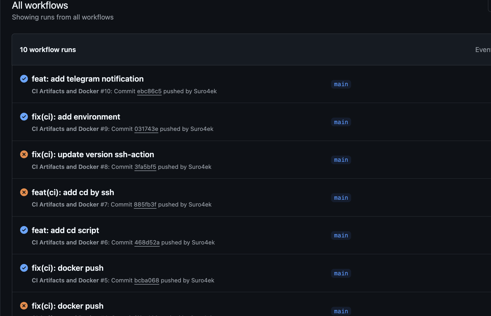
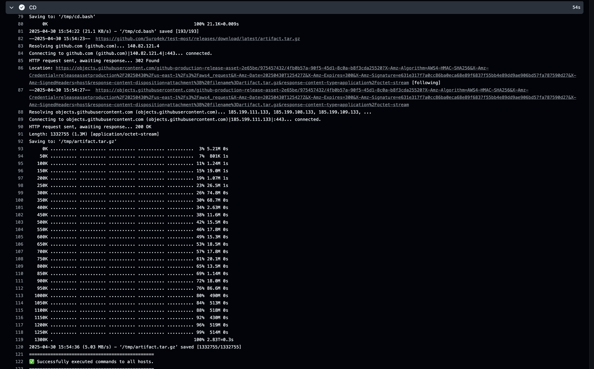
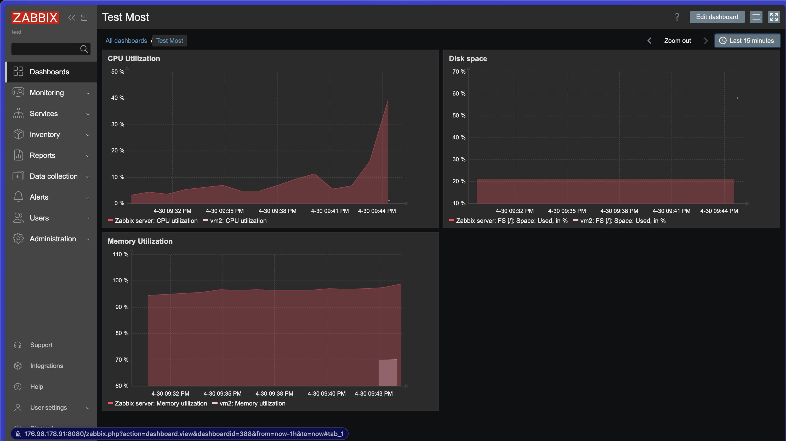
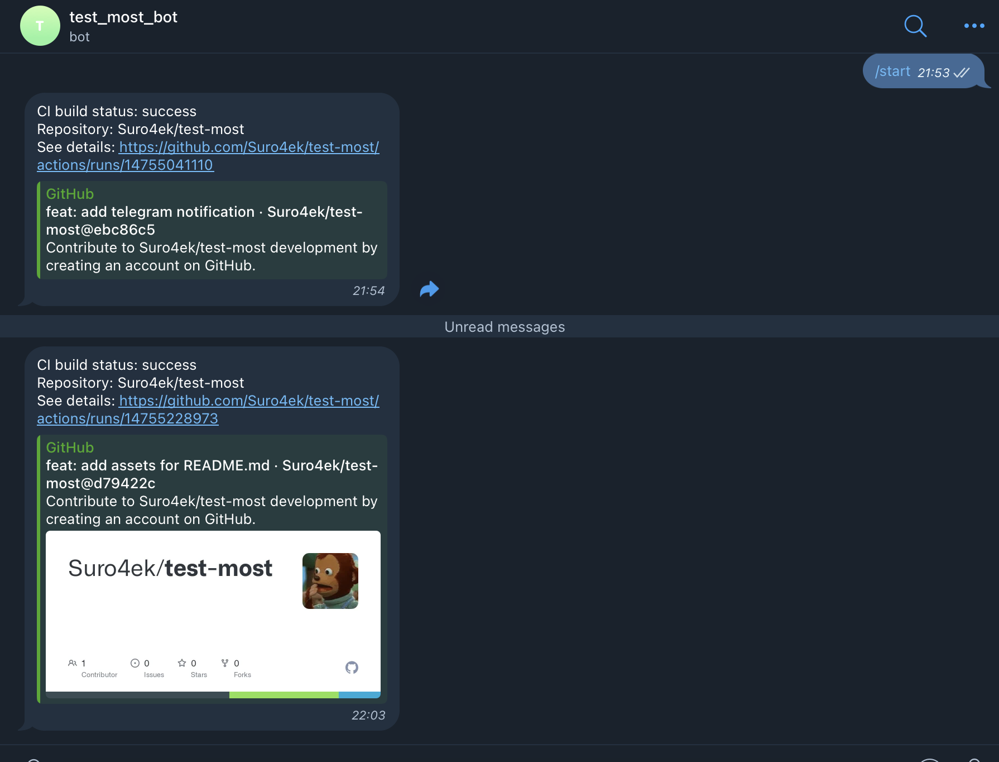

# Тестовая для компании МОСТ

Этот репозиторий содержит Hello World Go-приложение с настроенным CI/CD пайплайном, использующим GitHub Actions для автоматизации сборки, тестирования и развертывания.

<!--  -->

## Содержание

- [Описание проекта](#описание-проекта)
- [Структура проекта](#структура-проекта)
- [Требования](#требования)
- [Установка и запуск](#установка-и-запуск)
- [Использование Docker](#использование-docker)
- [CI/CD Процесс](#cicd-процесс)
- [Этапы разработки](#этапы-разработки)

## Описание проекта

Данный проект представляет собой минималистичное Go-приложение, которое выводит сообщение "Hello, World!". Основная цель проекта - демонстрация настройки CI/CD процесса с использованием GitHub Actions, включая:

- Автоматическую сборку и тестирование кода
- Создание и публикацию артефактов
- Автоматическую доставку на сервер
- Сборку и публикацию Docker образа
- Отправку уведомлений в Telegram

## Структура проекта

```
.
├── .github/
│   └── workflows/
│       └── ci.yaml         # Конфигурация GitHub Actions
├── test-go/
│   ├── cmd/
│   │   └── main.go         # Основной код приложения
│   ├── Dockerfile          # Файл для сборки Docker образа
│   └── go.mod              # Зависимости Go
└── cd.bash                 # Скрипт для развертывания на сервере
```

## Требования

Для локальной разработки:
- Go 1.24.2 или выше
- Docker (не обязательно)
- Git

Для CI/CD:
- GitHub аккаунт
- Доступ к серверу для деплоя (не обязательно)
- Telegram бот для уведомлений (не обязательно)

## Установка и запуск

### Клонирование репозитория

```bash
git clone https://github.com/Suro4ek/test-most.git
cd test-most
```

### Запуск локально

```bash
cd test-go
go run cmd/main.go
```

### Сборка

```bash
cd test-go
go build -o bin/server cmd/main.go
```

### Запуск собранного бинарного файла

```bash
./bin/server
```

## Использование Docker

### Сборка Docker образа

```bash
docker build -t test-go -f test-go/Dockerfile .
```

### Запуск контейнера

```bash
docker run --rm test-go
```

## CI/CD Процесс

Проект использует GitHub Actions для автоматизации процесса CI/CD. При пуше в ветку `main` запускается следующий процесс:

1. Сборка Go-приложения
2. Запуск линтера и тестов
3. Создание артефакта (tar.gz архив)
4. Публикация релиза
5. Развертывание на сервере
6. Отправка уведомления в Telegram
7. Сборка и публикация Docker образа в GitHub Container Registry

## Этапы разработки

### 1. Создание базового Go-приложения

На первом этапе было создано простое приложение на Go:

```go
package main

import "fmt"

func main() {
	fmt.Println("Hello, World!")
}
```

### 2. Настройка сборки и тестирования

Был настроен процесс сборки и тестирования с использованием стандартных инструментов Go.

### 3. Создание Dockerfile

Для контейнеризации приложения был создан Dockerfile с многоэтапной сборкой:

```Dockerfile
FROM golang:1.24.2 AS builder
COPY . /src
WORKDIR /src
RUN go build -o bin/server ./test-go/cmd/main.go

FROM alpine:latest AS production
RUN apk --no-cache add ca-certificates
COPY --from=builder /src/bin /app
WORKDIR /app
RUN mkdir /lib64 && ln -s /lib/libc.musl-x86_64.so.1 /lib64/ld-linux-x86-64.so.2
CMD ["./server"]
```

### 4. Настройка CI/CD пайплайна

Был создан и настроен GitHub Actions workflow для автоматизации всего процесса разработки:



### 5. Настройка автоматического развертывания на сервер

Для автоматического развертывания был создан скрипт `cd.bash`, который загружает и устанавливает последний релиз на сервер.




### 6. Настройка и развертывания zabbix server и агентов


### 7. Пример работы телеграмм

## Заключение


---

**Примечание**: Для использования полного функционала CI/CD необходимо настроить соответствующие секреты в настройках GitHub репозитория.

- `HOST` - IP-адрес или домен сервера для деплоя
- `USERNAME` - имя пользователя для SSH подключения
- `KEY` - приватный SSH-ключ
- `TELEGRAM_TO` - ID чата для отправки уведомлений
- `TELEGRAM_TOKEN` - токен Telegram бота
